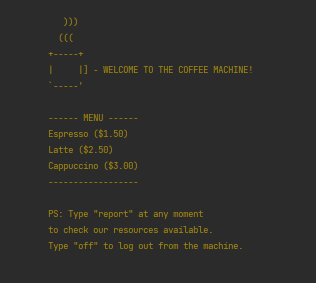

# Object-Oriented Programming | The Coffee Machine Project (revisited)
This is an Object-Oriented-Programming (OOP) version of the "Coffee Machine Project" from _Dr. Angela Yu's Python 
Bootcamp_, from the London App Brewery. **You can find the other version (non-OOP) in this author's other 
repository: [coffee-machine-project](https://github.com/barbaracalderon/coffee-machine-project)**

If you are studying programming paradigms, here's a suggestion: compare both projects (OOP and non-OOP).

### Project Requirements
Here's what this project requires:
- [x] Prompt user by asking "what would you like? (espresso/latte/cappuccino): "
- [x] Turn off the Coffee Machine by entering "off" to the prompt.
- [x] Print report.
- [x] Check if resources are sufficient.
- [x] Process coins.
- [x] Check if transaction is successful.
- [x] Make coffee.
